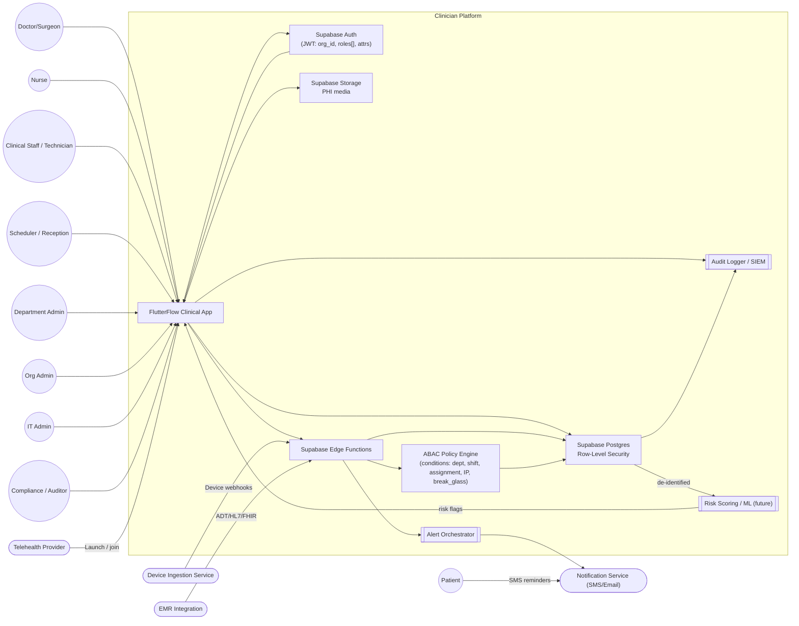

```mermaid
flowchart LR
  %% ACTORS
  Doctor((Doctor/Surgeon))
  Nurse((Nurse))
  ClinStaff((Clinical Staff / Technician))
  Scheduler((Scheduler / Reception))
  DeptAdmin((Department Admin))
  OrgAdmin((Org Admin))
  ITAdmin((IT Admin))
  Auditor((Compliance / Auditor))
  Patient((Patient))
  DeviceSvc(["Device Ingestion Service"])
  EMR(["EMR Integration"])
  Telehealth(["Telehealth Provider"])
  Notify(["Notification Service (SMS/Email)"])

  %% SYSTEM
  subgraph ClinPlatform[Clinician Platform]
    FF["FlutterFlow Clinical App"]
    Auth["Supabase Auth<br/>(JWT: org_id, roles[], attrs)"]
    DB["Supabase Postgres<br/>Row-Level Security"]
    Storage["Supabase Storage<br/>PHI media"]
    Edge["Supabase Edge Functions"]
    Policy["ABAC Policy Engine<br/>(conditions: dept, shift, assignment, IP, break_glass)"]
    Audit[["Audit Logger / SIEM"]]
    Alerts[["Alert Orchestrator"]]
    Analytics[["Risk Scoring / ML (future)"]]
  end

  %% FLOWS
  Doctor --> FF
  Nurse --> FF
  ClinStaff --> FF
  Scheduler --> FF
  DeptAdmin --> FF
  OrgAdmin --> FF
  ITAdmin --> FF
  Auditor --> FF

  FF <--> Auth
  Auth --> FF

  FF --> DB
  FF --> Storage
  FF --> Edge
  Edge --> DB
  Edge --> Policy
  Policy --> DB

  FF --> Audit
  DB --> Audit
  Edge --> Alerts
  Alerts --> Notify

  Patient -->|SMS reminders| Notify
  DeviceSvc -->|Device webhooks| Edge
  EMR -->|ADT/HL7/FHIR| Edge
  Telehealth -->|Launch / join| FF

  DB -->|de-identified| Analytics
  Analytics -->|risk flags| FF
```
